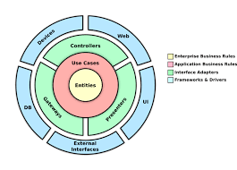

# HistoryAPI

Projeto historyAPI, desenvolvido como parte da ponderada de programação da semana 7.

## Tecnologias Utilizadas

### Framework e Linguagem
- [NestJS](https://nestjs.com/): Framework para construção de aplicativos Node.js eficientes e escaláveis.
- [TypeScript](https://www.typescriptlang.org/): Superset tipado de JavaScript.

### Banco de Dados
- [Prisma](https://www.prisma.io/): ORM para Node.js e TypeScript que facilita o trabalho com bancos de dados.
- [PostgreSQL](https://www.postgresql.org/): Sistema de gerenciamento de banco de dados relacional.

### Infraestrutura na Nuvem
- [AWS RDS](https://aws.amazon.com/rds/): Serviço de banco de dados relacional da Amazon Web Services.


### Testes
- [Jest](https://jestjs.io/): Framework de teste para JavaScript e TypeScript.
- [Supertest](https://www.npmjs.com/package/supertest): Biblioteca para testar APIs HTTP.

### Autenticação
- [JWT (JSON Web Tokens)](https://jwt.io/): Padrão para autenticação de usuários.

## Bibliotecas Auxiliares

- [Passport](http://www.passportjs.org/): Middleware de autenticação para Node.js.
- [Bcrypt](https://www.npmjs.com/package/bcrypt): Biblioteca para hashing de senhas.
- [Swagger](https://swagger.io/): Ferramenta para documentação e teste de APIs.
- [Class Transformer](https://github.com/typestack/class-transformer): Biblioteca para transformar objetos.
- [Class Validator](https://github.com/typestack/class-validator): Biblioteca para validação de classes e objetos.
- [OpenAI](https://beta.openai.com/): API para integração com modelos de linguagem avançados.

## Integrações
- Integração com a API da OpenAI para utilização de modelos de linguagem avançados.

## Arquitetura
Foi utilizada a arquitetura limpa para promover uma estrutura organizada e independente de detalhes de implementação. Essa abordagem facilita a manutenção e testabilidade do código.



1 - As "Entities" estão representadas pela camada "business" da aplicação", onde são definidas as regras de negócios e formatos de transferência de dados (DTOs).

2 - Os "Use Cases" são criados na camada "data" da aplicação, onde os contrados da camada "business" são assinados e mantidos.

3 - Os "Controllers" são criados na camada de "api" onde são utilizados para receber e validar as requisições antes de processar dados através de um recurso nativo do NestJs chamado de "Pipes".

4 - Como as camadas estão totalmente separadas, qualquer tipo de device ou aplicação consegue utilizar essa API. 

## Como Rodar os Testes

O projeto inclui testes unitários e de integração usando Jest e Supertest.


```bash
npm run test
```

## Como Rodar o Projeto

1 - Clone o projeto com o seguinte comando: 

```bash
git clone https://github.com/yagoar45/ponderada-semana7-prog.git
cd /ponderada-semana7-prog
```

2 - Instale as dependências do projeto: 

```bash
npm install
```

3 - Inicie em modo de desenvolvimento: 

```bash
npm run start:dev
```

### Como acessar a Documentação da API feita com Swagger

- Após rodar o projeto em modo de desenvolvimento, entre no navegador e insira essa url: 

```bash
http://localhost:3000/swagger
```


